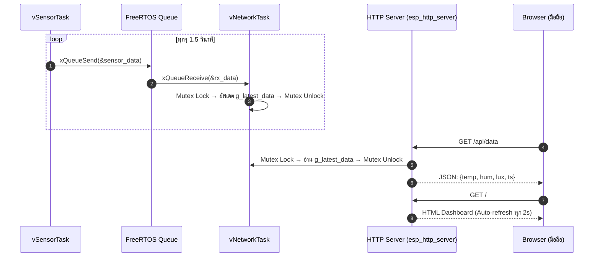

# ใบงานที่ 6.4: IoT Sensor Dashboard — แสดงผลค่าเซนเซอร์แบบ Real-Time ผ่าน Web Browser บนมือถือ

## 0. กล่าวนำ (Introduction)

ในใบงาน 6.3 นักศึกษาได้สร้างระบบ FreeRTOS Multi-Tasking ที่ `vSensorTask` อ่านค่าเซนเซอร์ → ส่งผ่าน Queue → `vNetworkTask` รับและ "เตรียม JSON" แต่ข้อมูลยังไม่ได้ออกไปสู่โลกภายนอก

ในใบงานนี้ นักศึกษาจะ**ต่อยอดโค้ด Lab 6-3 โดยตรง** โดยเพิ่ม
1. **ESP32 SoftAP** — ให้มือถือเชื่อมต่อ Wi-Fi ตรงโดยไม่ต้อง Router
2. **HTTP Web Server (`esp_http_server`)** — เปิด Endpoint 2 ตัว
   - `GET /` → หน้า Dashboard HTML Auto-refresh ทุก 2 วินาที
   - `GET /api/data` → ส่งค่า JSON ล่าสุดให้ Browser

---

## 1. วัตถุประสงค์ (Objectives)

1. เชื่อมโยง FreeRTOS Queue Pipeline กับ HTTP Web Server เพื่อส่งข้อมูลออกสู่ Browser จริง
2. ใช้งาน `esp_http_server` component ของ ESP-IDF ในการสร้าง REST API Endpoint บน ESP32
3. ออกแบบ ESP32 ให้ทำงานเป็น **SoftAP + HTTP Server** พร้อมกัน
4. เข้าใจการใช้ `SemaphoreHandle_t` (Mutex) เพื่อป้องกัน Race Condition เมื่อ HTTP Handler และ FreeRTOS Task แชร์ข้อมูลร่วมกัน

---

## 2. อุปกรณ์และซอฟต์แวร์ที่ใช้ในการทดลอง (Equipment & Tools)

1. บอร์ดไมโครคอนโทรลเลอร์ ESP32 จำนวน 1 บอร์ด
2. สายเชื่อมต่อ USB จำนวน 1 เส้น
3. สมาร์ตโฟนหรือ PC (สำหรับเปิด Browser ดู Dashboard)

---

## 3. สถาปัตยกรรมระบบ (System Architecture)



---

## 4. แนวคิดสำคัญ: Mutex ป้องกัน Race Condition

```
vNetworkTask                    HTTP GET Handler
─────────────────────────       ─────────────────────────
xSemaphoreTake(mutex)           xSemaphoreTake(mutex)
  g_latest_data = rx_data;         read g_latest_data
xSemaphoreGive(mutex)           xSemaphoreGive(mutex)
```

> [!WARNING]
> หากไม่ใช้ Mutex: HTTP Handler อาจอ่านข้อมูลขณะที่ `vNetworkTask` กำลังเขียนอยู่ ทำให้ได้ค่าที่ไม่สมบูรณ์ (Torn Read)

---

## 5. ซอร์สโค้ดการทดลอง (`main/main.c`)

ดูใน `ESP32_Project/Lab6-4-IoT-Sensor-Dashboard/main/main.c`

---

## 6. ขั้นตอนการทดลอง (Experimental Procedures)

1. Build และ Flash โค้ดลงบอร์ด ESP32
2. เปิด Serial Monitor ดู SSID และยืนยัน `[HTTP SERVER]: Started`
3. ใช้มือถือ **เชื่อมต่อ Wi-Fi ชื่อ `MY_ESP32_SENSOR_AP`** (Password: `12345678`)
4. เปิด Browser บนมือถือ แล้วไปที่ `http://192.168.4.1`
5. ควรเห็นหน้า Dashboard แสดง Temperature / Humidity / Light Lux และ Auto-refresh ทุก 2 วินาที
6. ทดสอบ JSON API โดยเปิด `http://192.168.4.1/api/data` ดู Raw JSON

ตัวอย่างหน้า browser


---


## 7. ตารางบันทึกผลการทดลอง (Experiment Results)

### 7.1 บันทึกข้อมูลจาก Dashboard

> **ตอบ:**

| ครั้งที่ | Temperature (°C) | Humidity (%) | Light Lux | Timestamp (ms) |
| :-: | :-: | :-: | :-: | :-: |
| 1 | 34.7 | 52.8 | 669 | 473270 |
| 2 | 26.7 | 62.8 | 573 | 506480 |
| 3 | 27.1 | 68.9 | 229 | 509500 |

---

### 7.2 ทดสอบ JSON API (/api/data)

> **ตอบ:** บันทึก Raw JSON Response จาก Browser:

```json
{"temperature":30.00,"humidity":68.30,"light_lux":560,"timestamp_ms":575770}
```
---

## 8. คำถามท้ายการทดลอง (Post-Lab Questions)

### 1. เหตุใดจึงต้องใช้ Mutex ในการป้องกันการเข้าถึงตัวแปร `g_latest_data` ร่วมกันระหว่าง `vNetworkTask` และ HTTP Handler? ถ้าไม่ใช้จะเกิดอะไรขึ้น?
> **ตอบ:** 
- **ป้องกันข้อมูลตีกัน (Race Condition):** เนื่องจากฝั่งเขียนข้อมูล (`vNetworkTask`) และฝั่งอ่านข้อมูล (HTTP Handler) ทำงานพร้อมกันบนคนละ Thread ตัว Mutex จะช่วยคิวให้อ่านหรือเขียนทีละฝ่าย
- **หากไม่ใช้:** ข้อมูลจะเกิด Data Corruption หรือได้ค่าขยะส่งกลับไปแสดงผลบนหน้าเว็บ

---

### 2. `esp_http_server` รัน Handler บน Thread ใด — เป็น Thread เดียวกับ FreeRTOS Task ของเราหรือไม่?
> **ตอบ:** 
- **คนละ Thread:** `esp_http_server` จะสร้าง Thread แยกของตัวเองชื่อ `httpd` เพื่อจัดการ HTTP Requests โดยเฉพาะ ไม่ได้รันบน Thread เดียวกับ `vNetworkTask` หรือ `vSensorTask`

---

### 3. การที่ Dashboard ใช้ `<meta http-equiv="refresh" content="2">` แทนที่จะใช้ JavaScript `fetch()` มีข้อดีและข้อเสียอย่างไร?
> **ตอบ:**
- **ข้อดี:** เขียนง่ายมาก ไม่ต้องเขียนโค้ด JavaScript ฝั่ง Client และประหยัดหน่วยความจำ Flash
- **ข้อเสีย:** หน้าเว็บจะกะพริบทุกๆ 2 วินาทีเพราะต้องดึง HTML ใหม่ทั้งหมดทำให้กิน Bandwidth และ CPU ของ ESP32 มากกว่า
---

## 9. ความรู้เพิ่มเติม: ESP-IDF `esp_http_server` API

| ฟังก์ชัน                                   | ความหมาย                                     |
| :----------------------------------------- | :------------------------------------------- |
| `httpd_start(&server, &config)`            | เริ่มต้น HTTP Server (เปิด Port 80)          |
| `httpd_register_uri_handler(server, &uri)` | ลงทะเบียน Handler สำหรับ URL path            |
| `httpd_resp_send(req, buf, len)`           | ส่ง Response กลับไปยัง Browser               |
| `httpd_resp_set_type(req, type)`           | กำหนด Content-Type (เช่น `application/json`) |
| `xSemaphoreCreateMutex()`                  | สร้าง Mutex สำหรับป้องกัน Race Condition     |
| `xSemaphoreTake(mutex, ticks)`             | Lock Mutex ก่อนอ่าน/เขียน Shared Data        |
| `xSemaphoreGive(mutex)`                    | Unlock Mutex หลังเสร็จ                       |
